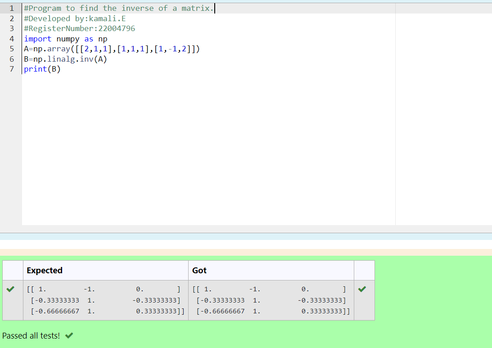

# INVERSE-OF-A-MATRIX
## Aim:
To write a python program to find the inverse of a matrix
## Equipment’s required:
1. 	Hardware – PCs
2. 	Anaconda – Python 3.7 Installation / Moodle-Code Runner
## Algorithm:
### Step1 :
import numpy as np
### Step 2: 
Prepare the lists from each linear equations and assign in np.array()
### Step 3: 
using the np.linalg.inv(), we can find the inverse of a matrix
### Step 4: 
end of the program

## Program:
```python
#Program to find the inverse of a matrix.
#Developed by:kamali.E
#RegisterNumber:22004796
import numpy as np
A=np.array([[2,1,1],[1,1,1],[1,-1,2]])
B=np.linalg.inv(A)
print(B)
```
## Output:

## Result:
Thus the inverse of given matrix is successfully solved using python program

